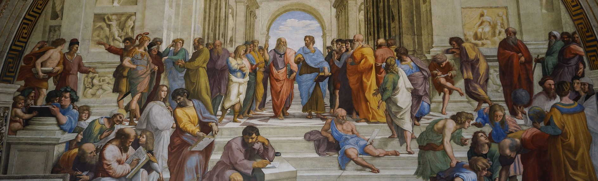

<p align="center">
    
</p>

# Hephaestus :rocket:

- In Greek mythology, Hephaestus was either the son of Zeus and Hera or he was Hera's parthenogenous child. ... As a smithing god, Hephaestus made all the weapons of the gods in Olympus. He served as the blacksmith of the gods, and was worshipped in the manufacturing and industrial centres of Greece, particularly Athens.

## Get Started :rocket:

- An Restful Api project developed with Flask.

- I used [Prometheus](https://prometheus.io/) and [Grafana](https://grafana.com/) for monitoring and containerization with Docker.

### Monitoring

- Using [Prometheus Flask exporter](https://pypi.org/project/prometheus-flask-exporter/) This library provides HTTP request metrics to export into Prometheus. It can also track method invocations using convenient functions.

- Grafana is a multi-platform open source analytics and interactive visualization web application. It provides charts, graphs, and alerts for the web when connected to supported data sources.

### containerization

- Docker hosts and containers monitoring with Prometheus, Grafana, Flask, MySQL.

- To run the project you need docker-compose and run this command:

```sh
docker-compose up -d
```

- To stop:

```sh
docker-compose down
```
